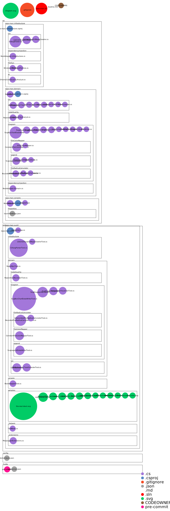

# repo-man

A console application that generates diagrams helping users to visualize the codebase. 
The original idea was to compile this project and run the resulting executable as a husky pre-commit hook. 
So each time you committed changes to the repository, an updated diagram would be generated, 
showing you the relative size of the files in your project, like this:



## DEPENDENCIES

- Visual Studio 2022
- .NET 8
- Nuget packages: libgit2sharp

## GETTING STARTED

The console project's launchSettings.json is configured to use its own git repo when you run the solution in debug mode, 
so you should be able to clone the repo and run it immediately.

If you want to run it from the command line, navigate to the folder with the executable and run it like this: 
```
repo-man.exe diagram --repo "C:\path\to\your\git\repo" --maxRadius 100 --outputDir "C:\path\to\output\folder" --background "white" --fileName "diagram.svg" --ignoreFileTypes "png|jpg|bmp"
```

## CONFIG OPTIONS

Because the tool is meant to be run from a command line or batch script, 
the primarily anticipated means of passing options is through command line args, 
but the Microsoft default host builder does set you up with the rest of the typical configuration sources.

When you call the tool from the command line, your first argument should always be the action you want to take. 
Currently "diagram" is the only action available, but in the future there will be additional actions to give better analysis. 

Below are additional configuration keys (case-sensitive) that can be passed at the command line:

- **repo (required)** - relative or absolute folder path to the git repository you want to diagram (the folder containing the .git folder)
- maxRadius - by default, diagrammed files have a radius range of 10 to 100. All of the file sizes in your repo are charted on that scale. If you have a wide disparity in file sizes, you may want to set the maxRadius lower so you can see the very small files better. Setting the maxRadius to 10 will chart all files the same size.
- outputDir - the directory to write the diagram.svg file. Defaults to the git repository root folder.
- background - sets the background color of the svg file. Defaults to "blanchedalmond" 🐿️.
- fileName - for setting the diagram file name, defaults to diagram.svg
- ignoreFileTypes - a pipe-delimited list of file extensions to ignore from analysis and from the diagram. For example, passing in "png|jpg|bmp" will ignore all image files from the diagram.

## TODO

- feature: change the intensity of the file color based on how recently it was modified if option passed in
- feature: change the intensity of the file color based on how many commits it has if option passed in

